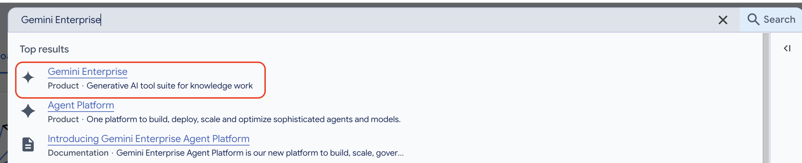
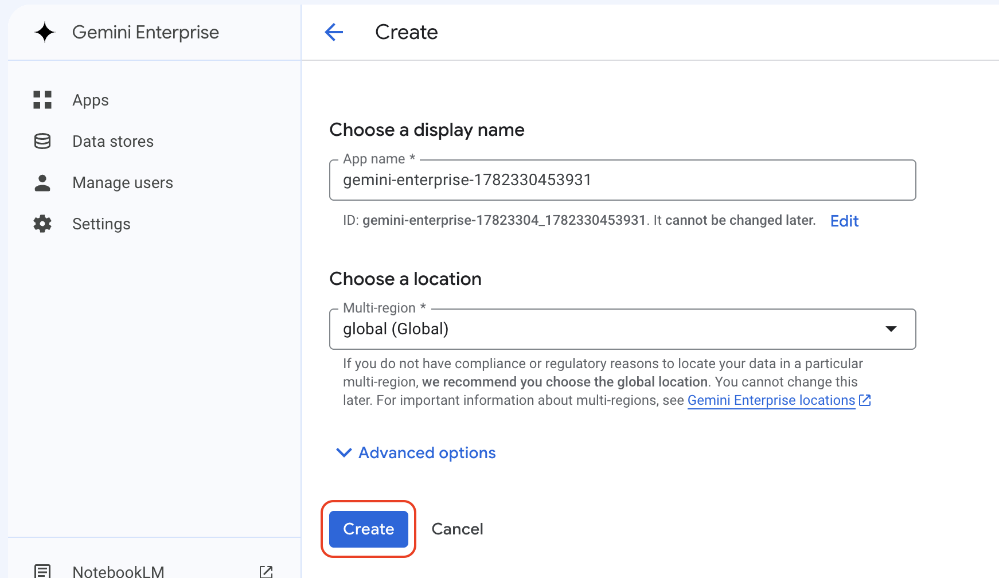
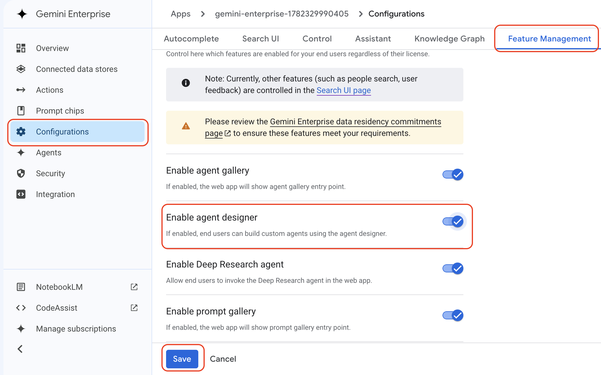
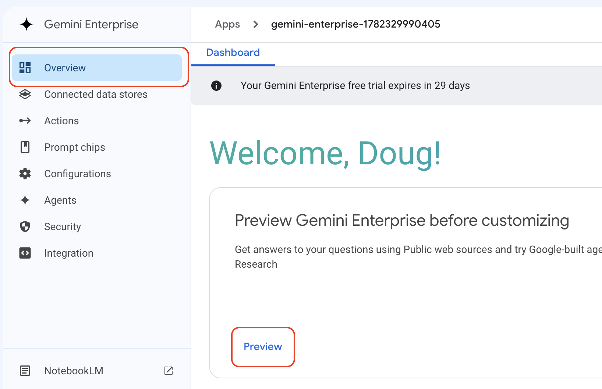

# Instructor Setup Guide

This guide covers how to set up the Gemini Enterprise environment needed to run the course demos. 

There are two options. Use whichever one you prefer. 

---

## Option 1: Use the ROI Demo Gemini Enterprise Environment

You can request access to the shared **ROI Demo Gemini Enterprise Environment**.

> **Contact Joe Wolfe on Slack** to request access. Once granted, you will be able to run all demos without any additional configuration.

---

## Option 2: Create a Temporary Gemini Enterprise Environment

Follow these steps to set up a temporary Gemini Enterprise environment in a new Google Cloud Project.

### Step 1 — Create a New Google Cloud Project

Create a new project in the [Google Cloud Console](https://console.cloud.google.com/).

---

### Step 2 — Search for Gemini Enterprise

In the search bar at the top of the Cloud Console, search for **Gemini Enterprise** and click on it.

---

### Step 3 - Start the 30-Day Free Trial

Click the __Start 30-day free trial__ button. Activate any required APIs if prompted. 

---

### Step 4 — Create the Gemini Enterprise Environment

Click **Create** to provision the Gemini Enterprise Environment.

---

### Step 5 — Enable the Agent Designer Feature

1. In the left-hand navigation, click **Configurations**.
2. Click **Feature Management** at the top of the page.
3. Enable the **Agent designer** feature.
4. Click the __Save__ button.

---

### Step 6 — Open Gemini Enterprise in the Browser

1. Click **Overview** in the left-hand navigation.
2. Click the **Preview** link to open Gemini Enterprise in your browser.

That's it, you should have access to do the demos. 

> **Note:** This is for you to do the demos. You do not need to provide access to students. They can do the demos after the course, but they would need to use their own company environment.

> **Warning:** Be sure to delete the Google Cloud Project before your 30-day trial expires, to ensure you are never charged. You can always create a new project and start another trial the next time you need it.

---

## Need Help?

If you run into any issues during setup, contact **Doug Rehnstrom** on Slack.
