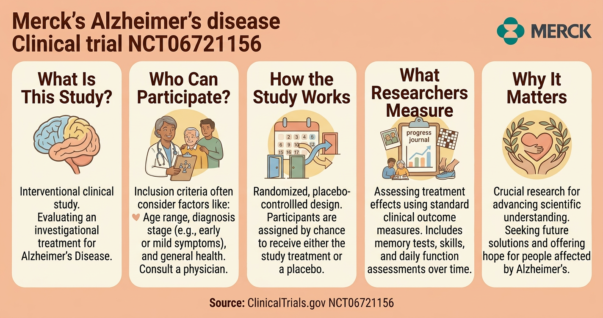

# Create an Infographic

## Time Required
20 minutes

## Overview
In this lab, you will use Gemini Image Generation to create a healthcare infographic related to Merck's Alzheimer's clinical trial work. The focus is prompt engineering using a simple framework:

- Persona
- Task
- Context
- Formatting

You will create a baseline infographic prompt, then iterate with small targeted changes.

### You learn how to:
- Structure image prompts with Persona, Task, Context, and Formatting.
- Build a clear infographic prompt from a real source page.
- Improve output quality by changing one part of the prompt at a time.

## Scenario

Merck's Marketing and Communications team wants a visual social post that explains, at a high level, an Alzheimer's disease clinical trial in a format that is easy for a general audience to scan.

Use this source for factual grounding:

- https://clinicaltrials.gov/study/NCT06721156

Your goal is to generate a clean infographic concept that is informative, hopeful, and easy to read.

## Lab Instructions

### Task 1: Build a PTCF Prompt (Persona, Task, Context, Formatting)

1. Open **Gemini Enterprise** and create a new chat.

2. In the chat bar, select the **Tools** icon and choose **Create images**.

3. Copy and paste the Merck logo into chat:

    <p align="left">
       
      <br>
    </p>

4. Copy and paste this prompt:

   ```text
   Persona:
   You are a healthcare visual communications designer who creates clear, trustworthy infographics for non-technical audiences.

   Task:
   Create a single-page infographic image for a social media post about Merck's Alzheimer's clinical trial (NCT06721156).

   Context:
   Use only high-level facts from the trial page: this is an interventional Alzheimer's disease study, includes randomization and placebo control, and evaluates treatment effects over time using standard clinical outcome measures. Do not invent numerical results or claim efficacy. Keep the tone informative, hopeful, and responsible.

   Formatting:
   - Layout: vertical infographic with 5 labeled sections: "What Is This Study?", "Who Can Participate?", "How the Study Works", "What Researchers Measure", "Why It Matters".
   - Visual style: modern, clean, medical-brand style using teal/blue accents and soft neutral backgrounds.
   - Include simple icons (brain, clipboard, calendar, shield, chart).
   - Add a short footer: "Source: ClinicalTrials.gov NCT06721156".
   - Place the attached Merck logo in the top-right corner.
   - Keep on-image text concise and legible.
   ```

5. Review the output and check whether it follows all 4 parts of PTCF.

### Task 2: Iterate with Small Changes

Make at least two iterations. Change only one area at a time:

1. **Persona change**

   ```text
   Keep everything the same, but use a friendlier, family-oriented visual tone while remaining medically accurate.
   ```

2. **Formatting change**

   ```text
   Keep everything the same, but convert the layout to a horizontal infographic for LinkedIn and increase heading contrast.
   ```

3. **Context guardrail change**

   ```text
   Keep everything the same, but add a clear note that this graphic is educational and not medical advice.
   ```

   <p align="left">
       
      <br>
      <em>Example Output</em>
    </p>


### Bonus Task 3: Build Your Own Prompt

Create a new infographic prompt for a healthcare or life sciences topic relevant to your team. Keep the same PTCF structure and limit each section to 1-3 lines.

## Congratulations

In this lab, you have:
- Used Persona, Task, Context, and Formatting to structure an image prompt.
- Generated a healthcare infographic from a real source page.
- Practiced controlled prompt iteration to improve clarity and design quality.
