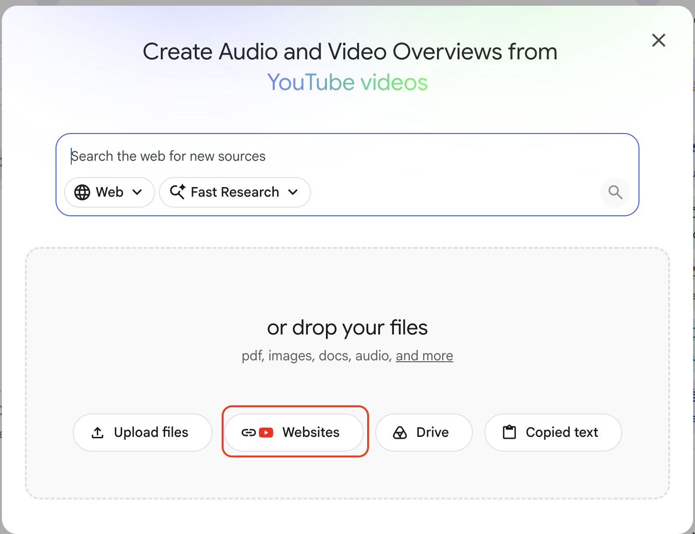
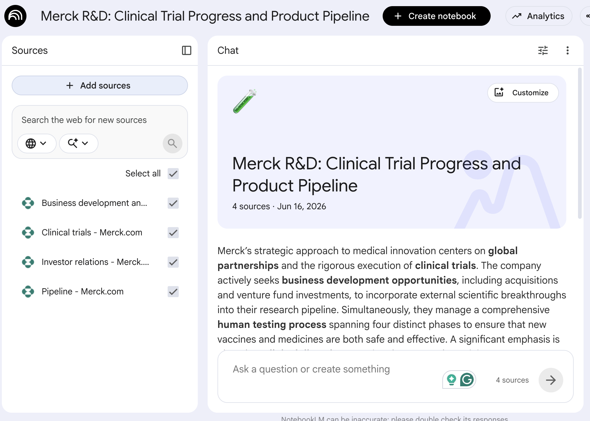

# Getting Started with NotebookLM

## Time Required
20 minutes

## Overview
In this lab, you will create a NotebookLM notebook for executive preparation using Merck's public web sources. You will add multiple sources, review the Notebook Guide, ask meeting-focused questions, and produce three deliverables: an executive summary, an audio overview, and a slide deck outline.

### You learn how to:
- Create a new notebook in NotebookLM.
- Add website sources directly into a notebook.
- Use NotebookLM to get a structured overview of a multi-source topic.
- Ask targeted, citation-grounded questions for leadership prep.
- Generate executive-ready outputs quickly.

## Scenario

<p align="left">
   
</p>

You are a Merck executive preparing for a board and investor meeting. You have 10 minutes to brief leadership on the current state of the pipeline and related strategic context.

You need a concise, source-backed summary covering pipeline highlights, clinical trial posture, partnering posture, and investor-facing context.

In this lab, you will use NotebookLM to collect and synthesize these public Merck sources:

- https://www.merck.com/research/product-pipeline/
- https://www.merck.com/research/business-development-and-licensing/
- https://www.merck.com/investor-relations/
- https://www.merck.com/research/clinical-trials/


## Lab Instructions

### Task 1: Create a Notebook and Add Web Sources

1. Open [NotebookLM](https://notebooklm.google.com/) in your browser. Sign in with your Google account if prompted.

2. On the NotebookLM home page, click **New notebook**.

   <p align="left">
     
     <br><em>The New notebook button on the NotebookLM home page</em>
   </p>

3. A new, empty notebook opens. The __Add Sources__ screen will open. 

   <p align="left">
     
     <br><em>The Sources panel in an empty notebook</em>
   </p>

4. Choose the option to add a **Websites**.

5. Add each of the following links as separate sources:

```text
https://www.merck.com/research/product-pipeline/
https://www.merck.com/research/business-development-and-licensing/
https://www.merck.com/investor-relations/
https://www.merck.com/research/clinical-trials/
```


6. Wait while NotebookLM processes the sources. Confirm all four appear in the Sources panel.

   > [!NOTE]
   > NotebookLM responses are only as strong as the sources you provide. Keep your source set focused and relevant to your meeting goal.

### Task 2: Explore the Notebook Guide

Once sources are added, NotebookLM automatically generates a **Notebook Guide** with key topics, themes, and suggested questions.

1. In the chat panel, click **Notebook Guide**.

   <p align="left">
     
     <br><em>The Notebook Guide provides an instant overview of your source</em>
   </p>

2. Read through the generated summary. NotebookLM should have identified:
   - Current Merck pipeline themes
   - Clinical development and trial context
   - Business development/licensing themes
   - Investor-facing priorities

3. Scroll to the **Suggested questions** at the bottom of the guide. These are questions NotebookLM has surfaced as important based on the document's content. Take note of them before moving to the next task.

   > [!NOTE]
   > The Notebook Guide is generated automatically but is not saved. If you want to keep it, click the **Save to note** icon (📌) before closing or scrolling past it.

### Task 3: Ask Targeted Questions

You need fast, source-backed talking points for a 10-minute board and investor brief. Ask each question and check citations.

**Question 1: Pipeline snapshot for leadership**

1. Type the following in the chat and press Enter:

```text
What are the most important current pipeline highlights I should present to the board in a 10-minute briefing?
```

- Review the answer and verify that each major claim is citation-backed.

2. Click **Save to note**.

**Question 2: Competitor and market context**

3. Type the following in the chat and press Enter:

```text
Based on the sources, what competitor and market context should I include so investors understand where Merck is positioned?
```

- Check that NotebookLM synthesizes across more than one source.
- Save this response to a note.

### Task 4: Create an Executive Summary

Now synthesize your notes into a short executive summary.

1. Run this prompt:

```text
Create a one-page executive summary for a board and investor meeting using only the sources in this notebook.

Include:
- 3-5 pipeline highlights
- 2-3 market/competitor context points
- 2-3 key risks or uncertainties
- A short recommended narrative for a 10-minute verbal brief

Keep it concise, clear, and citation-grounded.
```

2. Save it as a note.

### Task 5: Generate an Audio Overview

1. Click the arrow icon on the **Audio** button In NotebookLM Studio.

2. Select the __Brief__ option.

3. Prompt it with:

```text
Create an executive audio briefing for Merck leadership. Focus on pipeline status, market context, and key risks. Keep the tone confident, balanced, and factual.
```

   > [!NOTE]
   > It will take a while for the audio to be generated. Don't wait for it. Continue to the next step. 


### Task 6: Generate a Slide Deck

1. Click the arrow icon on the **Slide Deck** button In NotebookLM Studio.

2. Select the __Presenter Slides__ option, and click __Generate__. 


### Bonus Task 7: Apply This to Your Own Executive Brief

Create a new notebook for your own leadership topic. Add 3-5 trusted sources, ask focused briefing questions, and produce the same three outputs: executive summary, audio overview, and slide outline.

## Congratulations

In this lab, you have:
- Created a NotebookLM notebook and imported multiple web sources.
- Used the Notebook Guide to get a fast strategic overview.
- Asked targeted, citation-grounded questions for board/investor prep.
- Produced three executive deliverables: a summary, audio overview, and slide deck outline.
