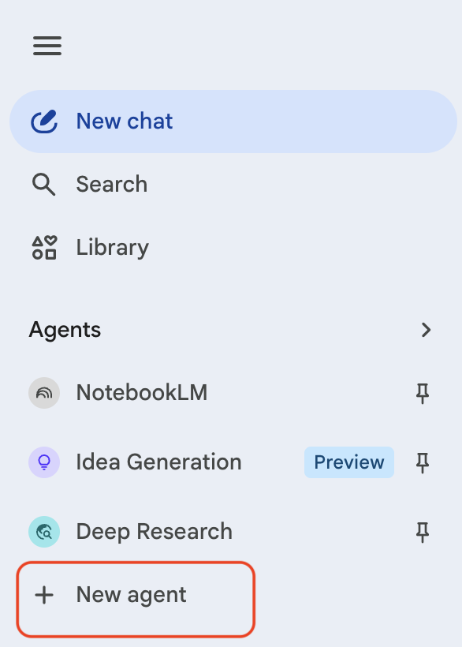
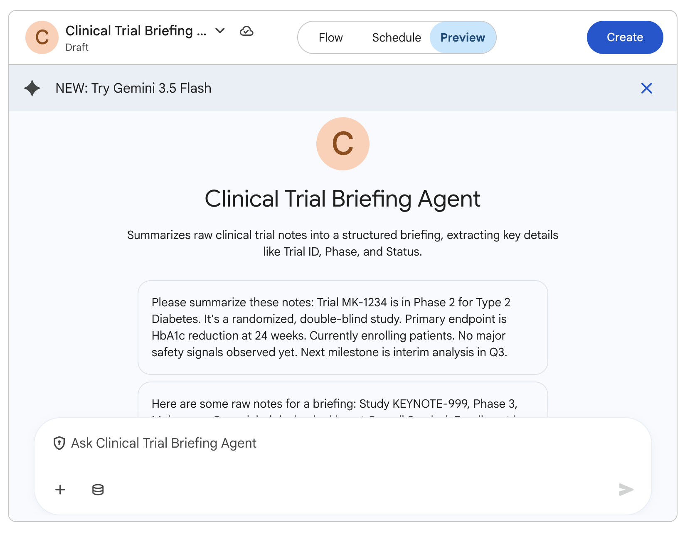

# Creating Simple Agents

## Time Required
15 minutes

## Overview
In this lab, you will create two lightweight agents in Gemini Enterprise Agent Designer. First, you will build a Clinical Trial Briefing Agent that turns unstructured trial text into a clean summary. Then, you will build a simple routing agent that escalates high-risk summaries.

### You learn how to:
- Create an agent using prompt-based design.
- Extract structured fields from unstructured clinical-trial text.

## Scenario

<p align="left">
  
</p>

Merck teams often need to quickly summarize trial updates for leadership. Raw notes and snippets are useful, but they are not briefing-ready.

In this lab, you will build one agent to create a standardized trial brief and a second agent system to route high-risk trial updates for escalation.

## Lab Instructions

### Task 1: Create the Clinical Trial Briefing Agent

This agent turns raw clinical-trial text into a clean, repeatable summary.

1. Open your Gemini Enterprise web app in a browser.

2. In the left navigation menu, click **+ New agent**.

   <p align="left">
     
     <br><em>The + New agent button in the Gemini Enterprise navigation menu</em>
   </p>

3. The **Agent Designer** page opens. In the chat box, paste the following prompt and click the **Submit** icon:

   ```text
   Create an agent called "Clinical Trial Briefing Agent" for Merck.

   This agent summarizes raw clinical trial notes into a structured briefing.

   When text is provided, extract and label:
   1. Trial ID
   2. Phase
   3. Indication
   4. Study design
   5. Primary endpoint
   6. Current status
   7. Safety signals
   8. Next milestone

   Rules:
   - If data is missing, write: "Not Provided - follow up required."
   - Do not invent facts.
   - End with: "Recommended Next Step" in one sentence.
   ```

4. The **Agent Designer canvas** appears with your agent and a live preview pane.

   <p align="left">
     
     <br><em>The Agent Designer canvas showing your new agent and the Preview tab</em>
   </p>

5. Click **Preview** and test with this sample input:

   ```text
   Trial update: MK-ALZ-204 is a Phase 2 randomized, placebo-controlled study in early Alzheimer's disease. Enrollment target is 420 participants across US and EU sites. Primary endpoint is change in CDR-SB at 18 months. Interim operations update indicates enrollment is slower than plan in EU sites. No new serious safety signal reported; common AEs include headache and infusion-related reactions. Database lock is currently projected for Q2 next year.
   ```

6. Check that all fields are captured and missing fields are flagged.

### Task 2: Refine and Launch

1. Improve the output with this refinement prompt:

   ```text
   Update the instructions so the Recommended Next Step always includes one concrete action and one owner (for example: Clinical Ops, Safety, or Regulatory).
   ```

2. Test once more. If good, click **Create** to launch.

   > [!IMPORTANT]
   > If you exit the Agent Designer without clicking **Create**, your agent is saved as a **Draft** and will not be available to use until it is launched.

3. Open **Chat with Agent** and run one quick verification test.


## Congratulations!

In this lab, you have:
- Created a clinical-trial summarization agent for Merck.
- Refined output quality with clear instruction updates.
