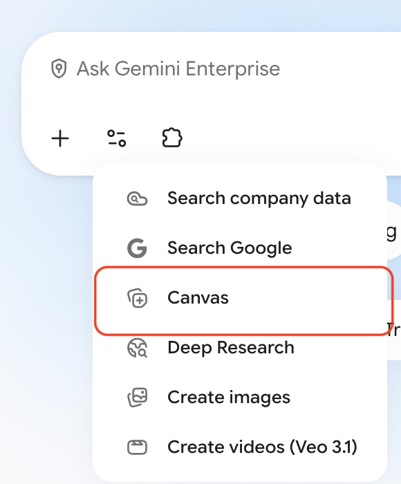
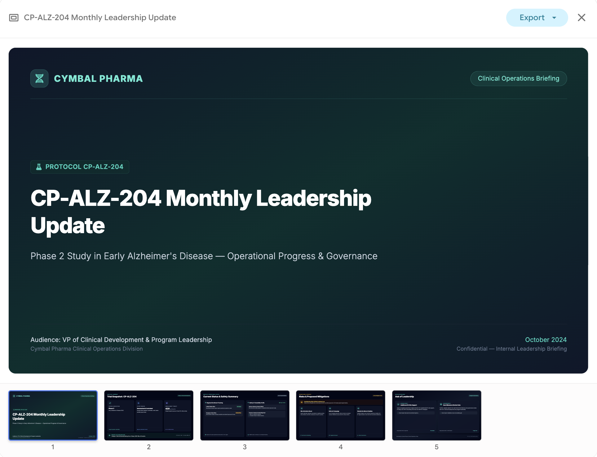
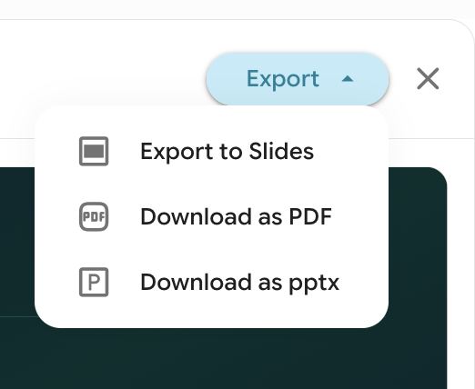

# Using Canvas to Generate Slides

## Time Required
15 minutes

## Overview
In this lab, you will use Gemini Enterprise **Canvas** to generate a short leadership slide deck from a single prompt. After the deck is created, you will export it to a format you can share with colleagues.

### You learn how to:
- Open the Canvas tool in Gemini Enterprise.
- Prompt Canvas to generate a structured slide deck.
- Export the deck to Google Slides, PDF, or PowerPoint.

## Scenario

<p align="left">
  
</p>

Cymbal Pharma's Clinical Operations team needs a quick leadership update on trial **CP-ALZ-204**, a Phase 2 study in early Alzheimer's disease. Enrollment is behind plan in EU sites, and leadership wants a short, clear deck for Monday's standing meeting.

Your job is to use Canvas to draft that deck in minutes, then export it so the team can review and refine it offline.

## Lab Instructions

### Task 1: Generate a leadership slide deck with Canvas

1. Open **Gemini Enterprise** in your browser and start a new chat.

2. In the chat bar, select the **Tools** icon and choose **Canvas**.

   <!-- PLACEHOLDER: Replace with a screenshot of the Tools menu highlighting Canvas -->
   <p align="left">
     
     <br>
     <em>Select the Canvas tool</em>
   </p>

3. Copy and paste the following prompt into the chat, then press ENTER:

   ```text
   Create a 5-slide leadership briefing deck for Cymbal Pharma Clinical Operations.

   Audience: VP of Clinical Development and program leadership.
   Topic: Monthly status update for trial CP-ALZ-204 (Phase 2, early Alzheimer's disease).

   Slide outline:
   1. Title slide — CP-ALZ-204 Monthly Leadership Update, Cymbal Pharma, current month/year
   2. Trial snapshot — Phase, indication, design (randomized, placebo-controlled), enrollment target (420 participants, US + EU), primary endpoint (change in CDR-SB at 18 months)
   3. Current status — enrollment behind plan in EU sites; US sites on track; no new serious safety signals; common AEs: headache and infusion-related reactions
   4. Risks and mitigations — EU enrollment lag; proposed actions (site activation boost, referral campaign, weekly enrollment huddles)
   5. Ask of leadership — approve additional EU site support and confirm next milestone review date

   Style: clean, professional, healthcare-appropriate. Use short bullets, not long paragraphs. Do not invent efficacy claims or safety conclusions beyond what is provided.
   ```

4. Wait for Canvas to generate the slide deck. Review each slide for structure, clarity, and accuracy against the prompt.

   <!-- PLACEHOLDER: Replace with a screenshot of the Canvas-generated slide deck -->
   <p align="left">
     
     <br>
     <em>Example Canvas-generated slide deck</em>
   </p>

5. Optional: Ask Canvas for a small refinement if anything looks off. For example:

   ```text
   Tighten slide 4 so each risk has exactly one mitigation bullet. Keep the tone factual and concise.
   ```

### Task 2: Export the slide deck

1. In the Canvas at the top-right, click the __Export__ button.

   <p align="left">
     
     <br>
     <em>Export options in Canvas</em>
   </p>

2. Export the deck in **one** of these formats:
   - **Google Slides** — best when collaborators will edit in Drive
   - **PowerPoint (.pptx)** — best for offline editing or sharing outside Google
   - **PDF** — best for a read-only handout

3. Open the exported file and confirm all five slides are present and readable.

4. Bonus (optional): Export a second copy in a different format and note which format is easiest for your team's review workflow.


## Congratulations!

In this lab, you have:
- Used Gemini Enterprise Canvas to generate a leadership slide deck from a single prompt.
- Reviewed and lightly refined the generated slides.
- Exported the deck to a shareable format (Google Slides, PDF, or PowerPoint).
