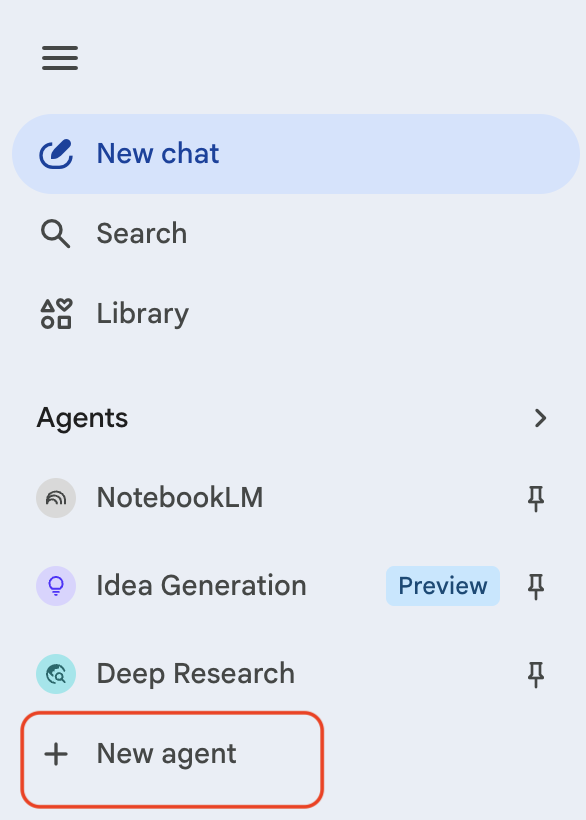
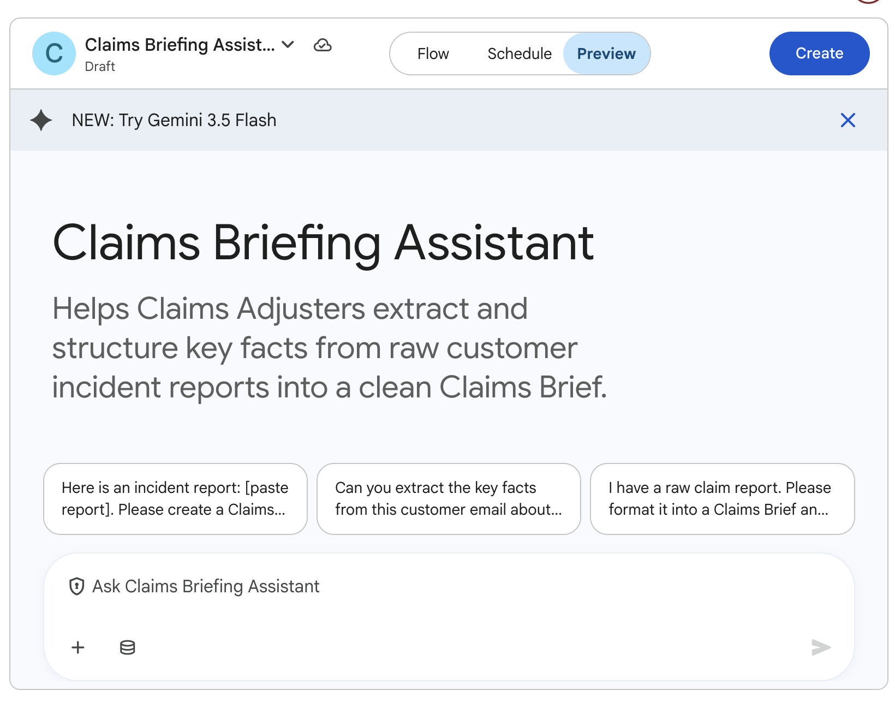
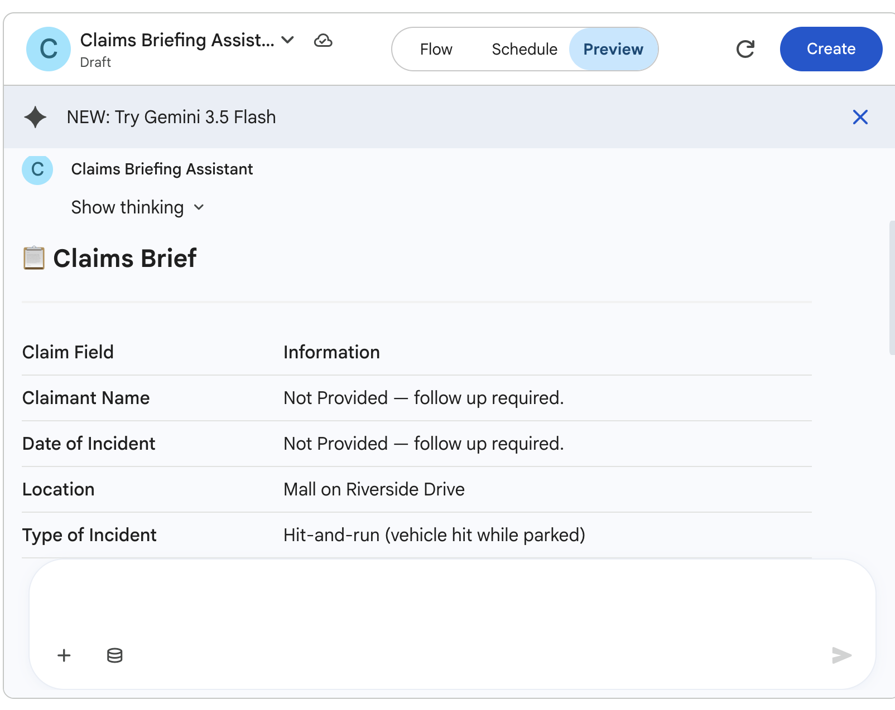
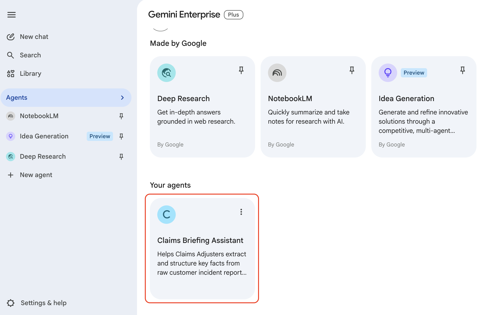
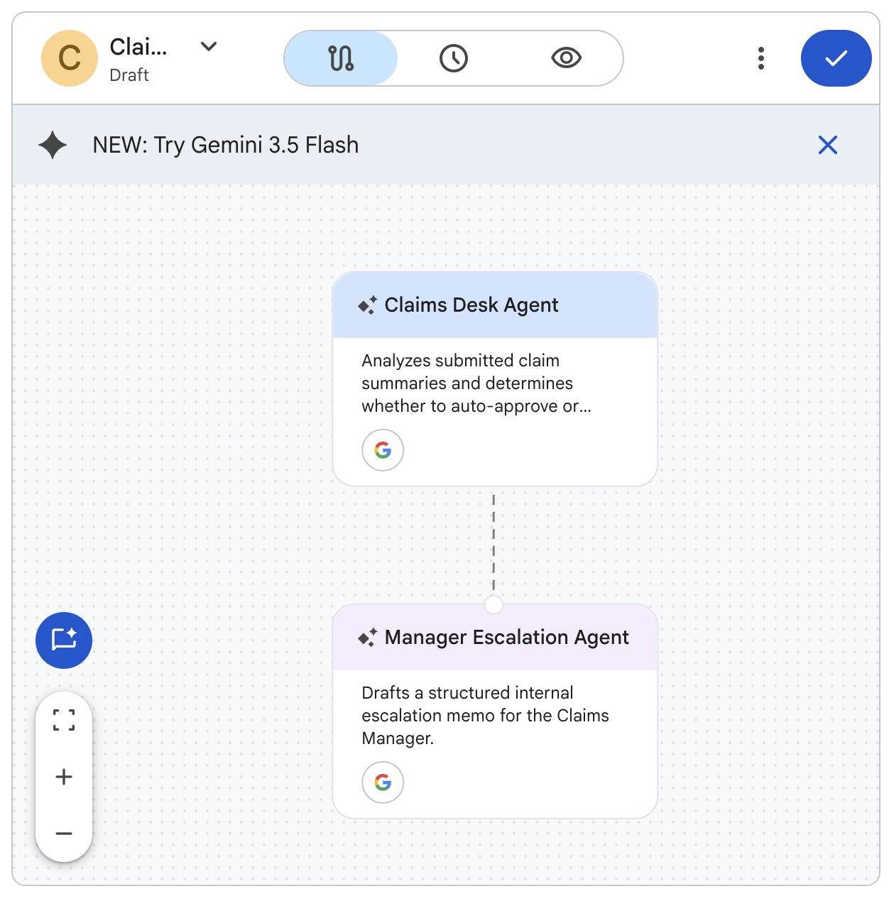

# Creating Simple Agents

## Time Required
20 minutes

## Overview
In this lab, you create two agents using the prompt-based creation method in Gemini Enterprise Agent Designer. You will start with a focused, single-purpose agent and then build a more sophisticated routing agent—all by describing what you want in plain language.

### You learn how to:
- Navigate to the Agent Designer and create an agent using a conversational prompt.
- Write effective agent instructions that produce consistent, structured output.
- Test and refine an agent using the Preview tab.
- Create a multi-step agent that triages inputs and routes them between two distinct roles.

## Scenario

<p align="left">
  
</p>

Cymbal Pharma's Clinical Operations and Medical Affairs teams receive dozens of unstructured trial updates every week—site emails, monitoring notes, and informal status snippets. Program leads spend significant time decoding those notes before they can brief leadership or act on risk.

In this lab, you build two agents that transform this process: one that structures raw trial updates into a standardized brief, and one that automatically triages trial risk and routes high-risk items for escalation.

## Lab Instructions

### Task 1: Create the Clinical Trial Briefing Assistant

The Clinical Trial Briefing Assistant helps Clinical Ops and Medical Affairs instantly extract and structure key facts from unformatted trial updates.

1. Open your Gemini Enterprise web app in a browser.

2. In the left navigation menu, click **+ New agent**.

   <p align="left">
     
     <br><em>The + New agent button in the Gemini Enterprise navigation menu</em>
   </p>

3. The **Agent Designer** page opens. In the chat box, paste the following prompt and click the **Submit** icon:

   ```text
   Create an agent called "Clinical Trial Briefing Assistant" for Cymbal Pharma.

   This agent helps Clinical Operations and Medical Affairs extract and structure key facts from raw, unformatted clinical trial updates.

   When a user pastes a trial update, the agent should:
   1. Extract and clearly label these eight fields: Trial ID, Phase, Indication, Study Design, Primary Endpoint, Current Status, Safety Signals, and Next Milestone.
   2. If any field is missing or unclear, flag it as "Not Provided — follow up required."
   3. Output a clean, consistently formatted "Trial Brief" using the exact field labels above.
   4. End every brief with a one-sentence "Recommended Next Step" based on the reported status and risk.

   The agent should be professional and factual. It must not add any information that was not stated in the trial update. Do not invent efficacy claims or safety conclusions.
   ```

> [!NOTE]
> Gemini Enterprise analyzes your prompt and may ask clarifying questions before building the agent. If it does, review what it proposes before proceeding.

4. The **Agent Designer canvas** appears with your agent and a live preview pane.

   <p align="left">
     
     <br><em>The Agent Designer canvas showing your new agent and the Preview tab</em>
   </p>

5. Click the **Flow** tab to inspect the generated agent structure. Click the agent node to review the generated **Name**, **Description**, and **Instructions**.

> [!NOTE]
> Review the generated instructions carefully. They should reflect what you described in the prompt. You can edit them directly in the configuration panel if anything needs adjustment.

### Task 2: Test and refine the Clinical Trial Briefing Assistant

1. Click the **Preview** tab. The conversational interface for your agent appears on the right.

2. Test the agent with the following sample trial update—paste it into the chat:

   ```text
   Ops note from this morning on CP-ALZ-204. Phase 2 early Alzheimer's study, randomized placebo-controlled. Target enrollment 420 across US and EU. Primary endpoint is change in CDR-SB at 18 months. EU sites still behind plan on enrollment; US looks okay. No new serious safety signal. Common AEs mentioned: headache and infusion-related reactions. Team thinks database lock is still pointing to Q2 next year. Site activation details were not in the note.
   ```

3. Review the generated Trial Brief. Ask yourself:
   - Are all eight fields extracted correctly?
   - Are missing fields flagged appropriately?
   - Is the Recommended Next Step specific and actionable?

   <p align="left">
     
     <br><em>The Agent Preview showing the first test response.</em>
   </p>


4. Let's try to improve the agent's output. Use the left chat pane to refine the agent with the following prompt:

   ```text
   Update the instructions so the Recommended Next Step always specifies one concrete action and one owner (for example: Clinical Ops, Safety, Medical Affairs, or Regulatory), such as "Clinical Ops: launch weekly EU enrollment huddles" or "Safety: request follow-up on infusion-related reactions."
   ```

5. Test again with the updated agent to confirm the refinement worked. Here is another example test prompt.

```text
Update on CP-ONC-118, Phase 3 randomized study in advanced NSCLC. Design is open-label, active-comparator. Primary endpoint is overall survival. Enrollment is on track at 82% of target. One SUSAR reported last week (Grade 4 hepatic enzyme elevation); investigation ongoing. Next milestone is interim analysis planned for March. Study design details beyond phase/indication were light in the note.
```

6. When you are satisfied with the output, click **Create** to launch the agent.

> [!IMPORTANT]
> If you exit the Agent Designer without clicking **Create**, your agent is saved as a **Draft** and will not be available to use until it is launched.

7. Click the __Chat with Agent__ button to open it in a new chat window. Test it again. You can use one of the earlier test prompts or enter your own.

8. Once your agent is deployed, it will be available in the __Agents__ screen in Gemini Enterprise. In the left-hand navigation menu, click **Agents**. You will see your agent in the __Your agents__ section.

   <p align="left">
     
     <br><em>The Clinical Trial Briefing Assistant agent deployed in Gemini Enterprise.</em>
   </p>

### Task 3: Create the Trial Risk Escalation Desk

The Trial Risk Escalation Desk is a two-part agent system. A Triage Agent assesses trial-update risk and determines routing; if escalation is needed, a Medical Monitor Escalation Agent drafts a structured internal memo for the Medical Monitor / Program Lead.

1. In the navigation menu, click **+ New agent** to open a fresh Agent Designer session.

2. In the chat box, paste the following prompt and click **Submit**:

   ```text
   Create an agent system called "Trial Risk Desk" for Cymbal Pharma. It should work as a two-step routing flow with two agents. The Trial Risk Desk Agent is the root agent that takes requests and the Medical Monitor Escalation Agent is a sub-agent.

   Agent 1 — Trial Risk Desk Agent:
   Analyzes a submitted trial update summary and determines the routing based on these rules:
   - ROUTINE FOLLOW-UP if: no serious safety signal (SUSAR/SAE) is reported AND enrollment is on track or only mildly behind plan AND no protocol deviation or data-integrity concern is indicated.
   - ESCALATE TO MEDICAL MONITOR if: a SUSAR or serious adverse event is reported, OR enrollment is significantly behind plan, OR a protocol deviation / data integrity concern is indicated, OR a key milestone slip is reported.
   Output: routing decision (ROUTINE FOLLOW-UP or ESCALATE TO MEDICAL MONITOR) and a one-sentence reason.

   Agent 2 — Medical Monitor Escalation Agent:
   Only triggered when the Trial Risk Desk Agent escalates an update.
   Drafts a structured internal escalation memo for the Medical Monitor that includes:
   - Memo header: To: Medical Monitor | From: Clinical Operations System | Re: Escalated Trial Update
   - Trial summary: Trial ID, phase, and indication
   - Reason for escalation
   - Key risk factors (safety signal, enrollment risk, protocol/data concern, or milestone slip)
   - Recommended next action for the Medical Monitor
   ```

3. The Agent Designer generates a multi-step agent flow. Click the **Flow** tab to inspect the structure. You should see the root connected to the Medical Monitor Escalation Agent.

   <p align="left">
     
     <br><em>The Flow tab showing the Trial Risk Desk Agent routing to the Medical Monitor Escalation Agent</em>
   </p>

4. Click the **Preview** tab and test the escalation path with this high-risk trial update.

   ```text
   Trial ID: CP-ALZ-204
   Phase: 2
   Indication: Early Alzheimer's disease
   Current Status: Enrollment significantly behind plan at EU sites (about 40% of EU target)
   Safety Signals: One SUSAR reported — Grade 3 anaphylactoid reaction after infusion; participant hospitalized; investigation ongoing
   Protocol / Data Concerns: None noted
   Next Milestone: Interim operations review slipped from this month to next quarter
   ```

5. Verify that the Triage Agent routes this update for escalation and that the Medical Monitor Escalation Agent produces a well-structured memo.

6. Now test the routine follow-up path.

   ```text
   Trial ID: CP-ONC-118
   Phase: 3
   Indication: Advanced NSCLC
   Current Status: Enrollment on track at 82% of target; US and EU sites performing to plan
   Safety Signals: No SUSARs; common AEs within expected range (fatigue, nausea)
   Protocol / Data Concerns: None
   Next Milestone: Interim analysis remains on schedule for March
   ```

7. Confirm this update is routed for routine follow-up without triggering an escalation memo.

8. When both paths work correctly, click **Create** to launch the agent.

### Bonus Task 4: Test the boundaries

The escalation rules become interesting at the edges. Use these scenarios to stress-test your routing logic.

1. Test each of the following edge cases and note how the Triage Agent responds:
   - An update with enrollment "mildly behind plan" and no safety signals—which path does it take?
   - An update where a safety issue is "suspected but not confirmed"
   - An incomplete update where the safety section is missing entirely

2. If the routing logic does not behave as expected, open the agent for editing. In the **Agent Gallery**, find **Trial Risk Desk** in the **Your agents** section, click **Actions**, and select **Edit**.

3. Use the left chat pane to adjust the thresholds or clarify the language:

   ```text
   Update the Trial Risk Desk Agent so that "suspected" serious safety issues and any missing safety information are both treated as escalation triggers. Also clarify that "mildly behind plan" alone remains ROUTINE FOLLOW-UP unless another risk factor is present.
   ```

4. Click **Reset session** to save and relaunch the agent. Retest the edge cases to confirm the changes took effect.

## Congratulations!

In this lab, you have:
- Created two agents using the prompt-based method in Gemini Enterprise Agent Designer.
- Written agent instructions that produce consistent, structured output.
- Tested and refined agents using the Preview tab.
- Built a multi-step agent that triages inputs and routes them between two distinct roles.
