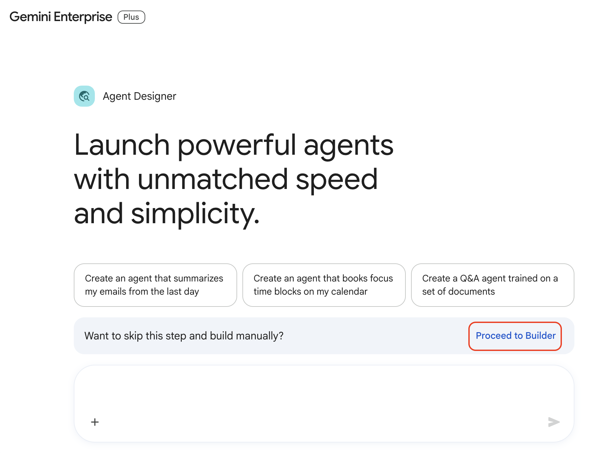
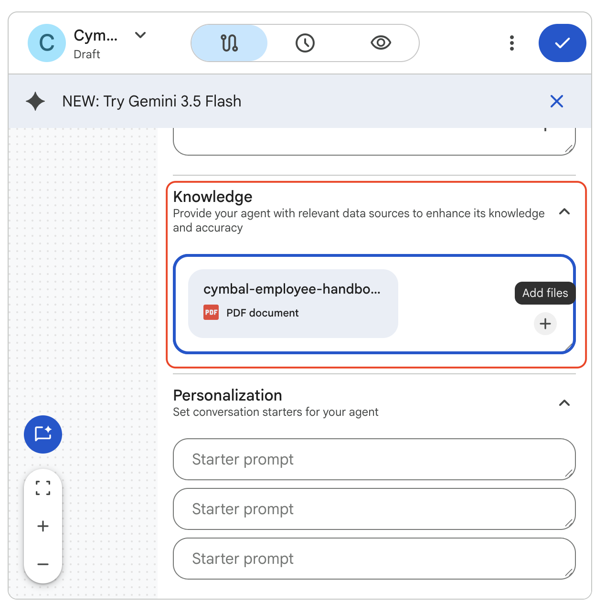

# Creating Agents with the Agent Designer

## Time Required
30 minutes

## Overview
In this lab, you use the Agent Designer's flow builder to manually configure two knowledge-grounded agents. Unlike the prompt-based method, the flow builder gives you direct control over every aspect of the agent: its instructions, model, uploaded knowledge documents, and starter prompts.

### You learn how to:
- Create an agent using the Agent Designer flow builder.
- Upload a knowledge document to ground an agent's responses in a specific source.
- Configure starter prompts that guide users to the most common tasks.
- Build a compliance-focused agent that audits content against a policy document.

## Scenario

<p align="left">
  
</p>

Cymbal Pharma's Clinical Operations and Pharmacovigilance teams face the same underlying problem: colleagues keep asking questions that are already answered in official study documents, and draft safety case summaries arrive that haven't been checked against reporting policy. Both problems slow teams down and increase risk when answers are guessed instead of grounded.

In this lab, you build two agents that put those source documents to work—one that answers study-procedure questions from a protocol synopsis, and one that audits draft safety case summaries before they move further in the process.

## Before You Begin

Both agents in this lab require a PDF knowledge document. You will create these from the sample content provided in each task.

For each document:
1. Open [Google Docs](https://docs.google.com) and create a new blank document.
2. Paste the sample content provided in the task.
3. Download as a PDF: **File > Download > PDF Document (.pdf)**.
4. Save the file using the filename specified in the task.

## Lab Instructions

### Task 1: Prepare the Protocol Synopsis and create the Clinical Study Navigator

1. Create a new Google Doc, paste the following content, and download it as **`cymbal-cp-alz-204-protocol-synopsis.pdf`**:

   ```text
   CYMBAL PHARMA—CP-ALZ-204 PROTOCOL SYNOPSIS (Summary Edition)

   STUDY TITLE
   A Phase 2 Randomized, Double-Blind, Placebo-Controlled Study of CP-412 in Early Alzheimer's Disease (CP-ALZ-204).

   STUDY DESIGN
   Multicenter, randomized, double-blind, placebo-controlled. Participants are randomized 1:1 to CP-412 or placebo. Treatment duration is 18 months with a 4-week safety follow-up.

   POPULATION
   Adults 50–85 years with early Alzheimer's disease (mild cognitive impairment due to AD or mild AD dementia). Key inclusion: CDR-Global Score of 0.5 or 1.0; Mini-Mental State Examination (MMSE) 22–30; confirmed amyloid pathology by PET or CSF. Key exclusion: other major neurodegenerative disease; uncontrolled major psychiatric illness; recent investigational product exposure within 30 days (or 5 half-lives).

   ENROLLMENT TARGET
   Approximately 420 participants across US and EU sites.

   PRIMARY ENDPOINT
   Change from baseline in CDR-SB at Month 18.

   KEY SECONDARY ENDPOINTS
   Change in ADAS-Cog13 at Month 18; change in ADCS-ADL-MCI at Month 18; safety and tolerability through Month 19.

   VISIT SCHEDULE (HIGH LEVEL)
   Screening (up to 42 days); Baseline/Day 1; Months 1, 3, 6, 9, 12, 15, and 18; Safety follow-up at Month 19. Cognitive assessments at Baseline and Months 6, 12, and 18.

   SAFETY REPORTING (STUDY-LEVEL)
   All serious adverse events (SAEs) must be reported to the sponsor safety desk within 24 hours of site awareness. Suspected unexpected serious adverse reactions (SUSARs) follow expedited reporting per applicable regulations. Infusion-related reactions are an identified risk and should be documented with onset time, severity, and intervention.

   CONTACTS
   Medical Monitor on-call: medical.monitor@cymbalpharma.example | Clinical Ops help desk: clinical.ops@cymbalpharma.example
   ```

2. Open your Gemini Enterprise web app and click **+ New agent** in the navigation menu.

3. On the Agent Designer page, click **Proceed to Builder** to open the flow builder directly.

   <p align="left">
     
     <br><em>Click Proceed to Builder to open the Flow tab directly</em>
   </p>

4. The **Flow** tab opens with a default agent node. Click the node to open its configuration panel on the right.

5. Configure the agent with the following values:
   - **Name:** `Cymbal Clinical Study Navigator`
   - **Description:** `Clinical Ops / site support assistant grounded in the CP-ALZ-204 protocol synopsis.`
   - **Instructions:** Paste the following:

   ```text
   You are the Cymbal Clinical Study Navigator, an internal assistant for Cymbal Pharma Clinical Operations, Medical Affairs, and site-facing colleagues supporting study CP-ALZ-204.

   Answer questions using only the information in the uploaded Protocol Synopsis document.

   Guidelines:
   - Provide clear, accurate answers about study design, population, endpoints, visit schedule, enrollment target, and study-level safety reporting expectations.
   - If the answer to a question is not in the Protocol Synopsis, respond: "I don't have that information in the CP-ALZ-204 Protocol Synopsis. Please contact Clinical Ops or the Medical Monitor."
   - Never guess or invent protocol details, efficacy claims, or safety conclusions. If you are uncertain, say so.
   - Keep responses professional, concise, and easy to understand.
   - If a question is ambiguous, ask one clarifying question before answering.
   ```

   - **Model:** Leave the default model selected.

6. Scroll to the **Knowledge** section of the configuration panel. Click **Add files** and upload `cymbal-cp-alz-204-protocol-synopsis.pdf`.

   <p align="left">
     
     <br><em>The Knowledge section after uploading the Protocol Synopsis PDF</em>
   </p>

7. Scroll to the **Personalization** section and add the following starter prompts:
   - `What is the primary endpoint for CP-ALZ-204?`
   - `What are the key inclusion criteria?`
   - `How quickly must SAEs be reported?`

> [!NOTE]
> Starter prompts help by giving examples of how the agent can be used, and allow you to just click on commonly used prompts.

### Task 2: Test the Clinical Study Navigator

1. Click the **Preview** tab.

2. Confirm that starter prompts appear. Click one to verify it triggers a relevant response.

3. Ask the following questions and evaluate the quality of each response:
   - "What is the randomization ratio and treatment duration?"
   - "Can a 48-year-old patient enroll?"
   - "When are cognitive assessments performed?"
   - "What should sites do if an infusion-related reaction occurs?"

4. Now test the agent's grounding by asking something the synopsis does not cover:
   - "What is the exact infusion rate for CP-412?"

> [!NOTE]
> The agent should respond that the information is not available in the Protocol Synopsis and direct the user to Clinical Ops or the Medical Monitor—not hallucinate an answer. This is the expected behavior for a well-grounded agent.

5. If any response is inaccurate or off-topic, click the **Flow** tab, open the agent node, and update the instructions. You can also type a refinement in the left chat pane:

   ```text
   Update the instructions to ensure the agent always cites the specific section of the Protocol Synopsis when answering questions about endpoints, population, visit schedule, or safety reporting.
   ```

6. When you are satisfied with the responses, click **Create** to launch the agent.

### Task 3: Create the Safety Reporting Auditor

1. Create a new Google Doc, paste the following content, and download it as **`cymbal-safety-reporting-policy.pdf`**:

   ```text
   CYMBAL PHARMA—SAFETY CASE REPORTING POLICY (Summary Edition)

   REQUIRED CASE ELEMENTS
   Every serious adverse event (SAE) case summary submitted for internal triage must include: Trial ID, Subject ID (or anonymized site subject code), Event term, Onset date, Severity grade, Seriousness criteria, Causality assessment (related / not related / not assessed), Outcome, and Narrative summary.

   REPORTING TIMELINES
   Sites must notify the sponsor safety desk within 24 hours of becoming aware of an SAE. Internal case triage must be completed within 1 business day of receipt. Potential SUSARs require Medical Monitor review before expedited submission packaging.

   NARRATIVE STANDARDS
   Narratives must include relevant medical history, concomitant medications, temporal relationship to study treatment, actions taken (dose interrupted, discontinued, treated), and current status. Do not include subject names, phone numbers, or other direct identifiers.

   EXPEDITED / SUSAR FLAGS
   Flag for Medical Monitor escalation if any of the following are true: event is serious AND unexpected based on the Reference Safety Information; Grade 4 or higher severity; death or life-threatening seriousness criterion; or causality is assessed as related / possibly related and unexpected.

   FOLLOW-UP INFORMATION
   If onset date, seriousness criteria, or causality is missing, the case is incomplete and must be returned for follow-up before final triage. Missing narrative details that prevent medical assessment also require follow-up.

   NON-COMPLIANT PRACTICES
   The following are not acceptable: inventing missing clinical facts; omitting seriousness criteria; submitting cases with direct personal identifiers; or marking a case complete when required elements are absent.
   ```

2. In your Gemini Enterprise web app, click **+ New agent** and then click **Proceed to Builder**.

3. Click the default agent node and configure it:
   - **Name:** `Safety Reporting Auditor`
   - **Description:** `Audits draft SAE case summaries against the Cymbal Pharma Safety Case Reporting Policy before triage.`
   - **Instructions:** Paste the following:

   ```text
   You are the Safety Reporting Auditor for Cymbal Pharma.

   You are grounded in the Safety Case Reporting Policy document. When a user submits a draft SAE case summary, do the following:

   1. Review the draft against the Safety Case Reporting Policy.
   2. Mark each required element / issue as one of:
      - ✅ COMPLIANT
      - ❌ NON-COMPLIANT — include the specific policy rule that was violated
      - ⚠️ NEEDS CLARIFICATION — if required information is missing or incomplete
   3. Output a structured "Safety Case Audit Report" with:
      - Each required element (Trial ID, Subject ID, Event term, Onset date, Severity grade, Seriousness criteria, Causality, Outcome, Narrative) with its status
      - Any expedited / SUSAR escalation flags
      - A Summary section: Elements Complete | Elements Flagged | Escalation Recommended (Yes/No)
   4. End with a one-sentence recommendation for the submitter.

   Be precise and professional. Reference the specific policy rule for every non-compliant or clarification flag. Do not invent clinical facts that are not in the draft.
   ```

4. In the **Knowledge** section, click **Add files** and upload `cymbal-safety-reporting-policy.pdf`.

5. Click the **Preview** tab and test with the following draft case summary:

   ```text
   Draft SAE case for internal triage

   Trial ID: CP-ALZ-204
   Subject: Site 014 / Subject 014-088 (Jane Doe, DOB on file with site)
   Event term: Anaphylactoid reaction
   Onset date: Not documented in draft
   Severity grade: Grade 3
   Seriousness criteria: Hospitalization
   Causality: Possibly related
   Outcome: Recovering
   Narrative: Participant developed rash and shortness of breath during infusion; infusion stopped; treated with antihistamine and steroids; transferred to ER for observation. Concomitant meds and relevant history not included. Unexpectedness not assessed in draft.
   ```

6. Review the audit report and verify that the following issues are caught:
   - Onset date missing → incomplete / needs clarification
   - Direct identifier present (subject name) → non-compliant
   - Narrative missing concomitant medications / relevant history → needs clarification
   - Possible SUSAR / Medical Monitor escalation flag because serious + possibly related + unexpectedness not assessed

7. Click **Create** to launch the agent.

8. Start a chat with the agent and ask the following questions:

```
What elements are required in every SAE case summary?
```

```
When does a case need Medical Monitor escalation for possible SUSAR handling?
```

### Bonus Task 4: Refine and extend

1. Open the **Safety Reporting Auditor** for editing. In the **Agent Gallery**, go to **Your agents**, find the agent, click **Actions**, and select **Edit**.

2. Use the left chat pane to request an output format improvement:

   ```text
   Update the Safety Case Audit Report to include a "Steps to Resubmit" section at the end. This section should list the specific changes the submitter must make to each flagged item before resubmitting the case.
   ```

3. Test the updated format with the same draft case summary from Task 3. Verify the new section appears and is actionable.

4. Add a couple starter prompts to the Safety Reporting Auditor agent.

5. Review the agent's instructions. Modify them any way you like to add capabilities or refine the outputs. Test after each change.

## Congratulations!

In this lab, you have:
- Created agents using the Agent Designer flow builder with manual configuration.
- Uploaded knowledge documents to ground agent responses in specific source material.
- Configured starter prompts to guide users to the most common tasks.
- Built a compliance-focused agent that generates structured safety case audit reports.
