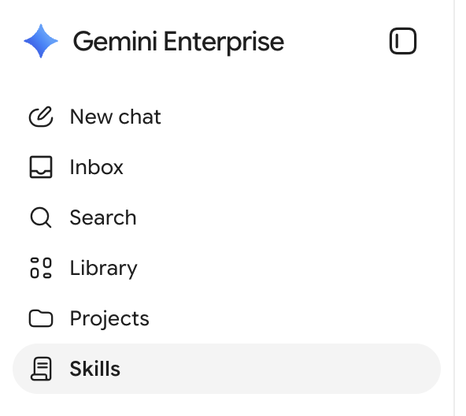
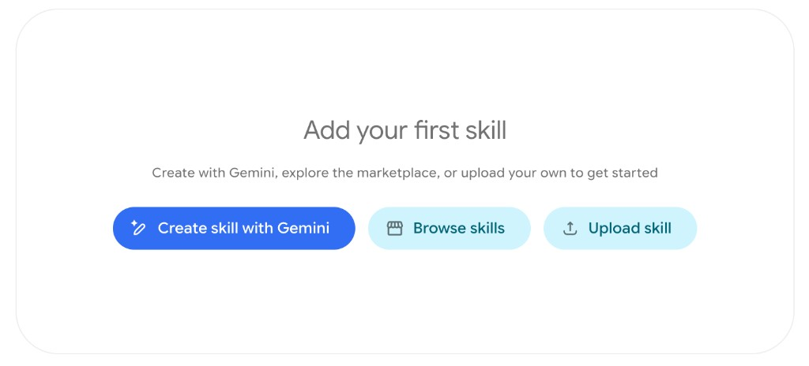
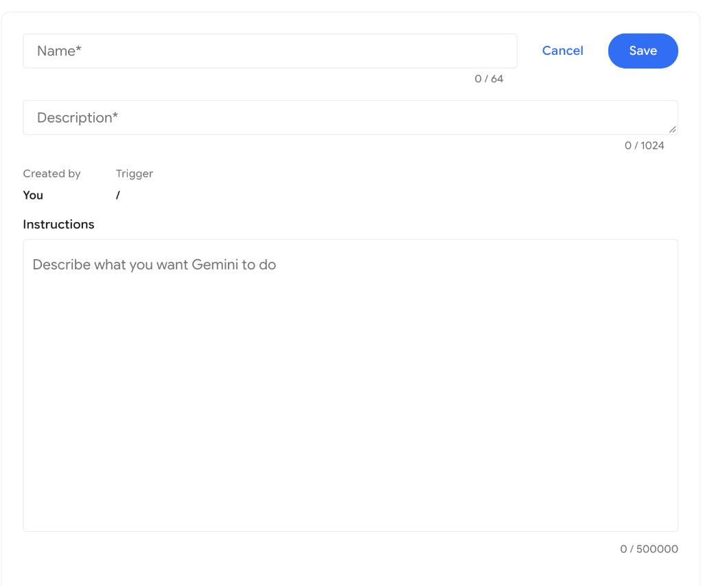

# Creating Skills

## Time Required
20 minutes

## Overview
In this lab, you create a reusable **Skill** in Gemini Enterprise. Skills are saved instruction sets—similar in spirit to Gems—that follow a standard skill protocol so you can invoke the same specialized prompt consistently from chat (typically with a `/` trigger). Unlike a full agent in Agent Designer, a Skill is lightweight: you define a name, description, and instructions, then reuse that behavior whenever you need it.

### You learn how to:
- Open **Skills** in Gemini Enterprise and start a new skill.
- Write clear skill name, description, and instructions for a pharma workflow.
- Save a skill and invoke it from chat.
- Refine skill instructions and retest with realistic inputs.

## Scenario

<p align="left">
  
</p>

Cymbal Pharma Medical Affairs and Clinical Operations colleagues often need the same kind of output over and over: a short, leadership-ready status brief from messy trial notes. Copying a long prompt into every new chat is slow and inconsistent.

In this lab, you create a **Trial Status Brief** skill that anyone on the team can invoke to turn raw updates into a consistent briefing format—without rebuilding the prompt each time.

## Lab Instructions

### Task 1: Create the Trial Status Brief skill

1. Open your Gemini Enterprise web app in a browser.

2. In the left navigation menu, click **Skills**.

   <p align="left">
     
     <br><em>Skills in the Gemini Enterprise left navigation</em>
   </p>

3. If you have not created a skill yet, you will see the empty state. Click **Create skill with Gemini** (or the equivalent create option if your screen already lists existing skills).

   <p align="left">
     
     <br><em>Add your first skill — create, browse, or upload</em>
   </p>

> [!NOTE]
> Your environment may also offer **Browse skills** (marketplace) and **Upload skill**. This lab focuses on creating a skill manually with name, description, and instructions.

4. The skill editor opens. You will see fields for **Name**, **Description**, **Trigger** (`/`), and **Instructions**.

   <p align="left">
     
     <br><em>Skill editor: Name, Description, Trigger, and Instructions</em>
   </p>

5. Enter the following values:

   - **Name:** `Trial Status Brief`
   - **Description:** `Turns messy Cymbal Pharma clinical trial updates into a short, leadership-ready status brief for Medical Affairs and Clinical Ops.`

6. In **Instructions**, paste the following:

   ```text
   You are a Trial Status Brief skill for Cymbal Pharma Medical Affairs and Clinical Operations.

   When the user provides a raw trial update (notes, email snippet, or monitoring text), produce a concise leadership brief with these exact sections:

   1. Trial ID
   2. Phase / Indication
   3. Status snapshot (2–3 bullets max)
   4. Safety signals (state "None reported" if none are mentioned)
   5. Risks / gaps (missing info or operational risk)
   6. Recommended next step (one sentence with a suggested owner: Clinical Ops, Safety, Medical Affairs, or Regulatory)

   Rules:
   - Use only information present in the user input.
   - If a field is missing, write: "Not provided — follow up required."
   - Do not invent efficacy claims, enrollment numbers, or safety conclusions.
   - Keep the tone professional and factual.
   - Prefer short bullets over long paragraphs.
   ```

7. Click **Save**.

### Task 2: Invoke the skill and test it

1. Start a **New chat** in Gemini Enterprise.

2. In the chat input, type `/` and select **Trial Status Brief** (or type enough of the name to find it).

> [!NOTE]
> Skills are triggered from chat with `/`. If you do not see your skill immediately, refresh the page or confirm the skill was saved under **Skills**.

3. After selecting the skill, paste this sample trial update and send:

   ```text
   Quick note on CP-ALZ-204 (Phase 2, early Alzheimer's). EU enrollment still lagging; US sites look closer to plan. No new SUSAR this week. Common AEs still headache and infusion-related reactions. Team wants leadership to approve extra EU site support before the monthly governance meeting. Database lock timing was not in the note.
   ```

4. Review the output. Confirm that:
   - All six sections appear with the expected labels
   - Missing items are flagged (for example, database lock / next milestone detail)
   - The recommended next step names an owner
   - No invented facts were added

5. Run a second test with a different therapeutic area:

   ```text
   CP-ONC-118 Phase 3 NSCLC update: enrollment at about 82% of target and on track. One Grade 4 hepatic enzyme elevation SUSAR under investigation. Interim analysis still planned for March. Site list and screen-failure themes were not included in this note.
   ```

6. Compare the two briefs. The structure should stay consistent even though the content changed.

### Task 3: Refine the skill instructions

1. Return to **Skills** in the left navigation and open **Trial Status Brief** for editing.

2. Update the **Instructions** by adding this requirement near the Rules section (or replace the Recommended next step rule with the stronger version below):

   ```text
   Additional rule:
   - In "Recommended next step", always include exactly one concrete action and one owner.
   - Add a final line labeled "Confidence": High if Trial ID, phase/indication, and status are present; Medium if one of those is missing; Low if two or more are missing.
   ```

3. Click **Save**.

4. Start a new chat, invoke `/Trial Status Brief` again, and retest with the CP-ALZ-204 sample from Task 2.

5. Confirm the brief now includes a clear owner in the next step and a **Confidence** line.

### Bonus Task 4: Explore skill options

1. In **Skills**, open the create flow again and note the other entry points:
   - **Browse skills** — explore shared / marketplace skills available in your environment
   - **Upload skill** — upload a skill package that follows the standard skill protocol (when your organization uses shared skill files)

2. Optional: Create a second, smaller skill for your own recurring prompt (for example, “Plain-Language Study Summary” or “Meeting Ask Extractor”). Keep instructions short, save it, and invoke it with `/`.

## Congratulations!

In this lab, you have:
- Created a reusable Gemini Enterprise Skill for a Cymbal Pharma briefing workflow.
- Invoked the skill from chat with `/` and tested it on realistic trial updates.
- Refined skill instructions to improve consistency (owner + confidence).
- Seen how Skills differ from full Agent Designer agents: lightweight, reusable prompts you can call on demand.
