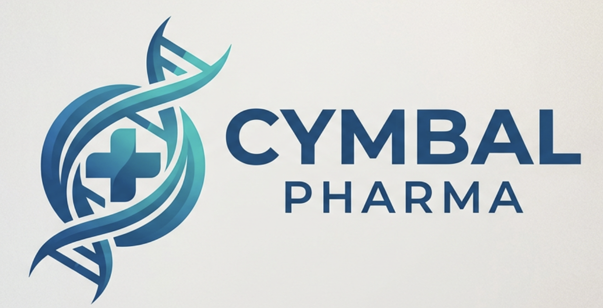

# Bring Your Own Use Case

## Time Required
45 minutes

## Overview
This is your lab. You have spent the previous labs building agents and skills for Cymbal Pharma—structured scenarios with defined prompts and expected outputs. Now it is your turn to define the problem and build the solution.

In this lab, you design and build an **agent** or a **skill** that solves a real challenge from your own work or organization. You will apply what you have learned: prompt-based agent creation, the Agent Designer flow builder, knowledge documents, starter prompts, and reusable Skills.

### You learn how to:
- Translate a real workplace problem into a well-defined use case.
- Choose the right approach: simple agent, knowledge-grounded agent, multi-step routing agent, or Skill.
- Write effective instructions that make your solution reliable and consistent.
- Test and refine using Preview (agents) or chat with `/` (skills).

## Your Scenario

This lab does not have a prescribed scenario. You will define one. Think about the tasks in your organization that are:
- **Repetitive**—done the same way every time, following a known process
- **Information-heavy**—require reading, summarizing, or extracting from documents or notes
- **Routing-based**—categorize inputs and direct them to different responses or owners
- **Reusable**—the same specialized prompt would help many people if it were easy to invoke

The best use cases solve a real pain point. Start there.

<p align="left">
  
</p>

> [!NOTE]
> Your use case does **not** need to be about Cymbal Pharma. The earlier labs used Cymbal Pharma only for practice. For this lab, pick something from your real Merck work.

## Lab Instructions

### Task 1: Define your use case

Before you build anything, invest a few minutes in clearly defining the problem. Solutions built from vague intentions are hard to test and even harder to refine.

1. In a new document or notebook, answer the following questions:

   - **What is the problem?** Describe in one or two sentences the specific task or workflow that is inefficient, inconsistent, or time-consuming today.
   - **Who does it affect?** Name the role or team that would benefit.
   - **What does it receive as input?** (Examples: a raw email, meeting notes, a form submission, a file upload, a short status update)
   - **What does it produce as output?** (Examples: a structured report, a routed decision, a drafted email, a summary, an audit checklist)
   - **What information does it need to do its job?** (Examples: a policy or protocol PDF, routing rules, field definitions—or none beyond the user input)

2. Based on your answers, choose the approach that fits your use case:

   | If your use case is... | Choose this approach | You practiced this in... |
   |---|---|---|
   | A single-purpose task with clear input and output | Simple agent (prompt-based) | Lab 1 |
   | Needs triage / routing between roles or paths | Multi-step agent with a sub-agent | Lab 1 (Trial Risk Desk) |
   | Grounded in a specific document or policy | Agent Designer with knowledge file upload | Lab 2 |
   | A reusable prompt you (or teammates) will invoke often in chat | Skill (`/` trigger) | Lab 3 |

> [!NOTE]
> You can combine approaches. A knowledge-grounded agent can also have starter prompts. A simple agent can later become a Skill if you mainly need a reusable prompt. Start simple and add complexity only if it is needed.

3. Write a one-paragraph description of your solution. Include: what it is called, whether it is an **agent** or a **skill**, what problem it solves, who uses it, what it takes as input, and what it produces as output. This paragraph will become the basis for your creation prompt or skill instructions.

### Task 2: Design and build your solution

#### Option A: Build an agent

1. Open your Gemini Enterprise web app and click **+ New agent**.

2. **If you are using the prompt-based method:** Write a detailed creation prompt based on your Task 1 description. Structure it clearly:

   ```text
   Create an agent called "[Your Agent Name]".

   Purpose: [One sentence describing the agent's job]

   When a user submits [describe the input], the agent should:
   1. [First action]
   2. [Second action]
   3. [Third action]

   Output format: [Describe the structure of the output — headers, sections, labels, etc.]

   Constraints:
   - [Any rules about what the agent should or should not do]
   - [Tone, length, or accuracy requirements]
   - Do not invent facts that are not in the input.
   ```

3. **If you are using the flow builder:** Click **Proceed to builder** and configure each node manually. For each agent node, write instructions that answer these three questions:
   - What is this agent's specific job?
   - What does it receive as input?
   - What exactly does it produce as output?

4. If your agent needs knowledge documents, prepare them before building:
   - Create a Google Doc with the relevant policy, reference material, or structured data
   - Download as a PDF
   - Upload in the **Knowledge** section of the agent configuration panel

5. If your agent benefits from starter prompts—the most common questions or requests a user would have—add up to three in the **Personalization** section.

#### Option B: Build a skill

1. In the left navigation, open **Skills**.

2. Click **Create skill with Gemini** (or the create option shown in your environment).

3. Enter a clear **Name** and **Description**, then paste strong **Instructions** based on your Task 1 paragraph. Include:
   - The exact output sections or format you want
   - Rules for missing information
   - A rule not to invent facts

4. Click **Save**.

### Task 3: Test and refine

A first draft rarely performs perfectly. Testing and refinement are part of the process.

1. **If you built an agent:** Click the **Preview** tab and run at least three tests using realistic inputs.  
   **If you built a skill:** Start a **New chat**, type `/`, select your skill, and run at least three tests.

2. For each test, evaluate:
   - Does it understand the input correctly?
   - Is the output structured the way you designed it?
   - Are edge cases handled appropriately, or does it break?

3. Identify the weakest part of the output and improve the instructions:

   - **Agent:** use the left chat pane in Agent Designer:

     ```text
     Update the instructions so that [describe the specific behavior you want to change].
     ```

   - **Skill:** reopen the skill in **Skills**, edit **Instructions**, and click **Save**.

4. Test again after each refinement. Repeat until the output is reliable across different inputs.

5. Optional but valuable: ask a colleague to test without seeing your instructions. Observe where they get confused or where the output does not meet their expectations. Use that feedback for one final refinement.

6. When you are satisfied:
   - **Agent:** click **Create** (or **Update**) to launch.
   - **Skill:** confirm it is saved and invokable with `/` in a new chat.

> [!NOTE]
> You can always return to edit. For agents: **Agent Gallery > Your agents > Actions > Edit**. For skills: open **Skills** and edit your skill. There is no penalty for iterating after launch.

### Bonus Task 4: Extend your solution

Choose one or more of the following extensions.

**Add knowledge documents (agents)**
If your agent currently relies entirely on general model knowledge for organization-specific facts, upload a relevant PDF in **Knowledge**. Test whether grounding improves accuracy and reduces hallucinations.

**Add starter prompts (agents)**
Add up to three starter prompts for the most common requests users will have.

**Turn a strong prompt into a Skill**
If you built an agent mainly to reuse one prompt pattern, also create a Skill version with the same instructions so teammates can invoke it quickly with `/`.

**Add a simple routing path (agents)**
If your agent currently handles multiple distinct responsibilities in one instruction block, consider a root agent plus one sub-agent for escalation or a second role—similar to the Trial Risk Desk pattern from Lab 1.

**User test with a real scenario**
Share your agent or skill with someone who would genuinely use it. Give them three realistic inputs. Collect feedback on what was useful, confusing, or missing—then make one concrete improvement.

## Congratulations!

In this lab, you have:
- Translated a real workplace problem into a clearly defined use case.
- Chosen an approach appropriate for your scenario (agent and/or skill).
- Written instructions that produce reliable, structured output.
- Tested and refined using realistic inputs and feedback.

You have now practiced prompt-based agents, knowledge-grounded agents, reusable Skills, and applying the same craft to a problem you care about. The tools stay the same—the skill is defining the problem clearly enough that Gemini Enterprise can help solve it reliably.
